<!-- ================================================================
     U-SHOP — SYSTEM ARCHITECTURE DOCUMENT (SAD) v1.1
     Author  : Richard Nuhu
     Date    : June 9, 2026 (Patch Release — Production Fixes)
     Derived From: PRD v1.3 · SRD v1.1
     ================================================================ -->

<div align="center">

<br/>

<h1>
  <span style="background:#FF0000;color:#FFFFFF;padding:4px 16px;font-size:2.2rem;font-weight:900;border-radius:4px;">U</span>&nbsp;<span style="color:#5D1A89;font-size:2.2rem;font-weight:900;">sh</span><span style="color:#D1148A;font-size:2.2rem;font-weight:900;">op</span>
</h1>

<h2 style="color:#5D1A89;margin-top:0.5rem;">System Architecture Document</h2>
<p style="color:#D1148A;font-weight:600;font-size:1.05rem;">Version 1.1 — Principal Architecture Reference</p>

<br/>

| Field | Value |
|---|---|
| **Document** | System Architecture Document (SAD) |
| **Version** | 1.1 |
| **Author** | Richard Nuhu |
| **Derived From** | PRD v1.3 · SRD v1.1 |
| **Date** | June 9, 2026 — Patch Release — Production Bottleneck Fixes |
| **Status** | Approved — Architecture Baseline |
| **Stack** | Next.js 15 (App Router) · Vercel · AWS RDS · AWS S3 · Better Auth · Prisma · Paystack · Resend · Sentry · @vercel/functions |

</div>

---

<br/>

# <span style="color:#5D1A89;">Table of Contents</span>

| § | Section |
|---|---|
| 0 | [Document Control](#s0) |
| 1 | [High-Level Infrastructure Topology](#s1) |
| 2 | [Authentication & Security Architecture](#s2) |
| 3 | [Data Storage & Asset Management Strategy](#s3) |
| 4 | [Core Data Flow Diagrams](#s4) |
| 5 | [Entity-Relationship Blueprint](#s5) |
| 6 | [DevOps & Observability Pipeline](#s6) |
| 7 | [Architecture Decision Records](#s7) |
| 8 | [Document History](#s8) |

---

<br/>

<a name="s0"></a>

# <span style="color:#5D1A89;">0. Document Control</span>

## <span style="color:#D1148A;">0.1 Purpose</span>

This System Architecture Document (SAD) defines the structural decomposition, component interactions, data flows, and infrastructure topology for U-Shop v1 MVP. It is the authoritative reference for all engineering decisions made during the June–August 2026 build sprint. Where this document conflicts with the PRD or SRD, the SRD takes precedence for implementation specifics; this SAD governs component boundaries and interaction contracts.

## <span style="color:#D1148A;">0.2 Architectural Principles</span>

| Principle | Application |
|---|---|
| **Unified Full-Stack** | A single Next.js 15 repository is the entire platform — no separate API server, no microservices. Server Components, Route Handlers, and Server Actions replace a standalone Express backend. |
| **Zero Trust at the API Layer** | Every Route Handler independently verifies the Better Auth session. Middleware is a UX gate, not a security gate. Server-side role checks are non-negotiable. |
| **Immutable Pricing Snapshots** | All monetary fields are captured as `Decimal(10,2)` at order creation time. No float arithmetic. Historic orders are never retroactively recalculated. |
| **Zero Buyer-Seller Communication** | No `Message` model exists. Seller contact fields (`whatsappNumber`, `phone`) are excluded at the Prisma `select` level in all buyer-facing queries. Enforced in data layer, not just UI. |
| **Async-Safe Serverless** | All S3 mutations and email dispatches are non-blocking (Vercel `waitUntil()` or fire-and-forget after API response). No operation that could exceed Vercel's 10-second function timeout is awaited in the critical path. `setImmediate` is prohibited. |
| **Cost-Bounded by Design** | AWS RDS free tier (12 months) + Prisma Accelerate pooling + Vercel Hobby (free) + Resend free tier = ~$0.50/month fixed infra cost. Every architectural choice is evaluated against this constraint. |

## <span style="color:#D1148A;">0.3 Reference Documents</span>

| Document | Version | Status |
|---|---|---|
| Product Requirements Document (PRD) | 1.3 | Approved |
| System Requirements Document (SRD) | 1.1 | Approved |
| System Architecture Document (SAD) | **1.1** | **This document** |

---

<br/>

<a name="s1"></a>

# <span style="color:#5D1A89;">1. High-Level Infrastructure Topology</span>

## <span style="color:#D1148A;">1.1 End-to-End Architecture Diagram</span>

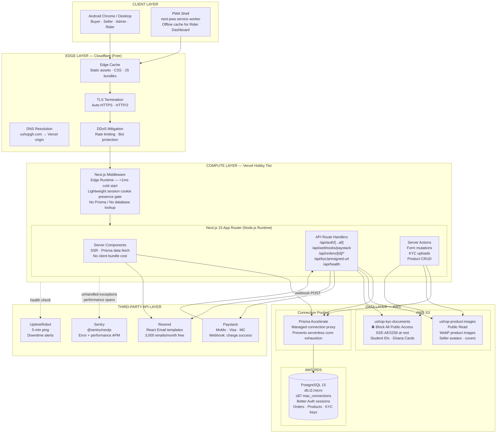

## <span style="color:#D1148A;">1.2 Layer Responsibilities</span>

### Edge Layer — Cloudflare

The edge layer handles all concerns that must be resolved before a request touches application code. This is purely infrastructure — no business logic resides here.

| Responsibility | Implementation |
|---|---|
| DNS resolution | `A` record pointing `ushopgh.com` to Vercel's assigned IPs |
| TLS termination | Cloudflare Universal SSL; all HTTP → HTTPS redirects enforced at edge |
| Static asset caching | `Cache-Control: public, max-age=31536000, immutable` on Next.js `/_next/static/*` |
| DDoS mitigation | Cloudflare free tier provides Layer 3/4 protection and basic Layer 7 rate limiting |
| Origin shielding | Vercel's real IP is never exposed; all traffic proxied through Cloudflare |

### Compute Layer — Vercel (Next.js 15)

Vercel executes the application as a collection of serverless Node.js functions (one per route or route group). The Edge Runtime is used exclusively for `middleware.ts` due to its sub-millisecond cold start and geographic distribution.

| Runtime | Used For | Timeout |
|---|---|---|
| **Edge Runtime** | `middleware.ts` (Lightweight cookie check only) | ~50ms |
| **Node.js Runtime** | All Server Components, Route Handlers, Server Actions | 10s (Hobby) |

> ⚠️ **Critical Constraint:** Every Node.js serverless function on Vercel Hobby tier has a hard 10-second execution timeout. Background operations (such as S3 image cleanup) MUST use Vercel's `waitUntil()` helper to prevent Lambda freeze after the HTTP response has been sent.

### Data Layer — AWS

AWS is used exclusively for persistent data storage. No compute runs on AWS in V1 — the `db.t2.micro` instance is accessed via Prisma Accelerate and never directly from client code.

| Service | Role | Access Pattern |
|---|---|---|
| AWS RDS PostgreSQL | Primary datastore — all relational data | Prisma ORM via Accelerate pooler |
| `ushop-product-images` | Publicly readable product photos | Direct URL reads; app writes via AWS SDK |
| `ushop-kyc-documents` | Private identity documents | App writes only; admin reads via presigned URL |

### Third-Party API Layer

All third-party services are called exclusively from server-side code (Route Handlers, Server Actions, Server Components). No third-party API key is ever exposed to the browser.

| Service | Integration Point | Direction |
|---|---|---|
| Paystack | `/api/webhooks/paystack` receives events; checkout page initialises Inline JS | Inbound (webhook) + Outbound (API) |
| Resend | Called from Route Handlers and Server Actions | Outbound only |
| Sentry | `@sentry/nextjs` SDK instruments all Node.js functions automatically | Outbound (error/perf data) |

## <span style="color:#D1148A;">1.3 Prisma Accelerate Connection Pool Topology</span>

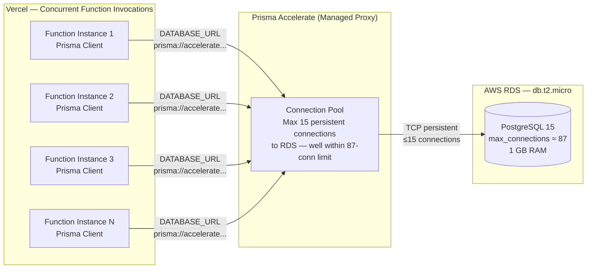

**Problem solved:** Without Prisma Accelerate, each of N concurrent Vercel function invocations would open a new TCP connection to RDS. At 88+ concurrent requests, the `max_connections` limit is breached and new queries begin failing with `too many clients`. Accelerate maintains a warm pool of ≤15 connections to RDS regardless of how many Vercel function instances run simultaneously.

---

<br/>

<a name="s2"></a>

# <span style="color:#5D1A89;">2. Authentication & Security Architecture</span>

## <span style="color:#D1148A;">2.1 Better Auth Integration Architecture</span>

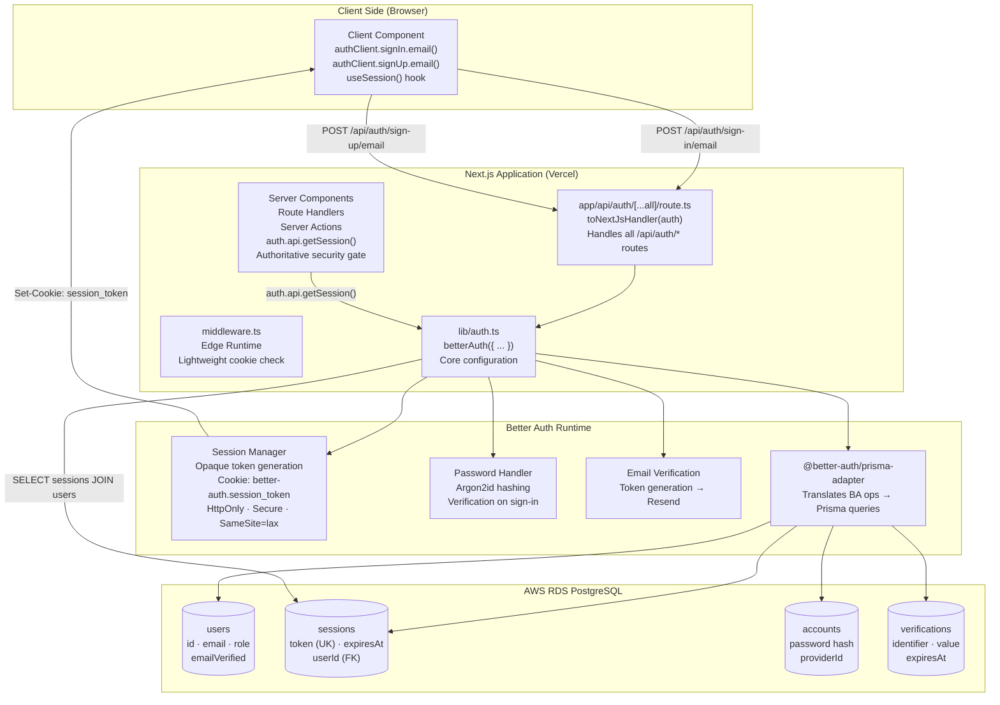

## <span style="color:#D1148A;">2.2 Session Lifecycle — Sign-In Flow</span>

```mermaid
sequenceDiagram
    autonumber
    participant C as Client Component
    participant API as /api/auth/sign-in/email
    participant BA as Better Auth Core
    participant DB as PostgreSQL

    C->>API: POST { email, password }
    API->>BA: betterAuth handler (via toNextJsHandler)
    BA->>DB: SELECT * FROM accounts WHERE email = ?
    DB-->>BA: Account record (password hash)
    BA->>BA: Argon2id verify(password, hash)
    alt Password invalid
        BA-->>C: 401 Unauthorized { error: "INVALID_CREDENTIALS" }
    end
    BA->>DB: INSERT INTO sessions (token, userId, expiresAt)
    DB-->>BA: Session created
    BA-->>C: 200 OK\nSet-Cookie: better-auth.session_token=<opaque>\nHttpOnly; Secure; SameSite=lax; Max-Age=604800
    Note over C: Session token stored in HttpOnly cookie.\nNever accessible to JavaScript.
```

## <span style="color:#D1148A;">2.3 RBAC Middleware Gate — Request Flow</span>

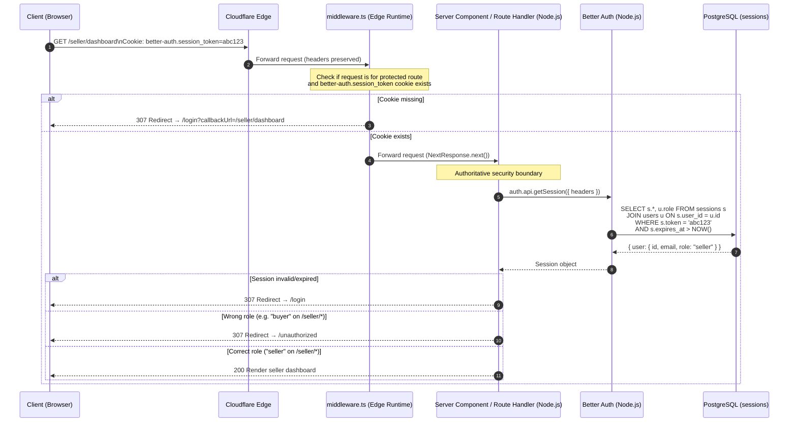

## <span style="color:#D1148A;">2.4 RBAC Route Guard Matrix</span>

| Route Prefix | Required Role(s) | Unauthorised Redirect | Notes |
|---|---|---|---|
| `/admin/*` | `admin` | `/unauthorized` | All admin API sub-routes also verified server-side via `requireRole()` |
| `/seller/*` | `seller` | `/unauthorized` | Seller pages; data scoped to `sellerProfile.userId = session.user.id` |
| `/rider/*` | `rider` | `/unauthorized` | Mobile-optimised OTP dashboard |
| `/account/*` | `buyer`, `seller`, `admin` | `/login` | Order history, profile settings |
| `/api/auth/*` | Public | — | Better Auth catch-all handler |
| `/api/webhooks/paystack` | Public (HMAC-verified) | — | No session required; authenticated via HMAC-SHA512 |
| All others | Public | — | Product browsing, storefronts |

> ⚠️ **Authoritative Guard Rule:** Middleware is a lightweight UX gate only that checks cookie presence (§2.5 of SRD). Every protected Server Component, Route Handler, and Server Action must independently verify authentication and roles via `auth.api.getSession()` before processing requests or rendering views.

## <span style="color:#D1148A;">2.5 Security Threat Model Summary</span>

| Threat | Mitigation |
|---|---|
| Session token theft | HttpOnly cookie prevents JS access; `Secure` flag prevents HTTP transmission |
| Session fixation | Better Auth regenerates session token on sign-in |
| Timing attack on HMAC comparison | `crypto.timingSafeEqual()` used in Paystack webhook verification |
| Timing attack on OTP verification | `bcrypt.compare()` is inherently constant-time per hash computation |
| Brute-force on OTP | 5-attempt lockout per order; Sentry alert on lockout; OTP has 4-hour TTL |
| Privilege escalation (role self-assignment) | `role` field has `input: false` in Better Auth config; only admin server actions can update it |
| Path traversal on KYC keys | Presigned URL endpoint validates `s3Key.startsWith("kyc/")` before signing |
| SQL injection | Parameterised queries via Prisma ORM; raw queries use `Prisma.sql` tagged templates |
| CSRF | Better Auth `SameSite=lax` cookie; state-mutating API calls require active session |
| Seller contact data leak | Prisma `select` excludes `whatsappNumber` and `phone` in all buyer-facing queries |

---

<br/>

<a name="s3"></a>

# <span style="color:#5D1A89;">3. Data Storage & Asset Management Strategy</span>

## <span style="color:#D1148A;">3.1 Dual S3 Bucket Architecture</span>

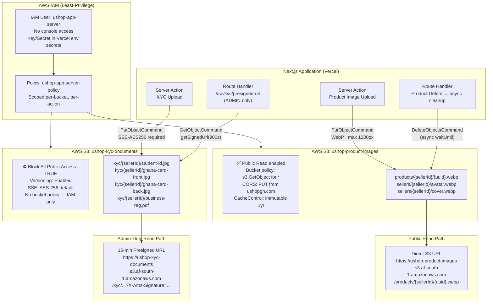

## <span style="color:#D1148A;">3.2 KYC Document Upload Flow</span>

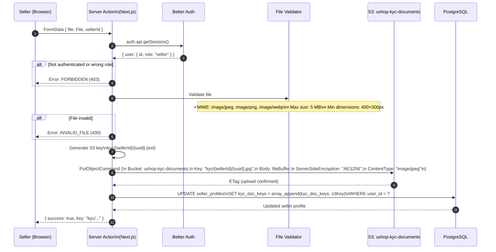

## <span style="color:#D1148A;">3.3 KYC Document Read — Presigned URL Flow</span>

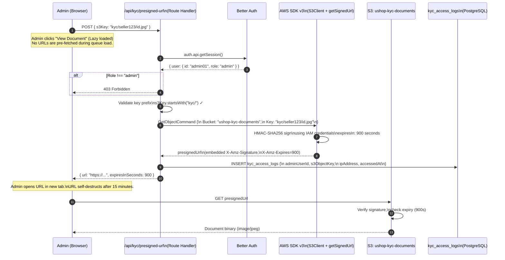

## <span style="color:#D1148A;">3.4 Product Image Lifecycle</span>

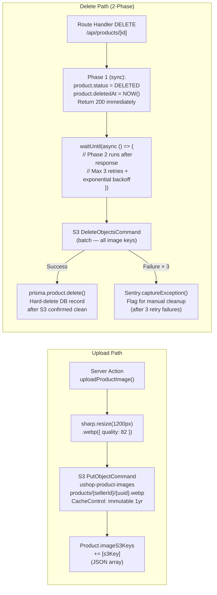

---

<br/>

<a name="s4"></a>

# <span style="color:#5D1A89;">4. Core Data Flow Diagrams</span>

## <span style="color:#D1148A;">4.1 Checkout & Paystack Webhook Flow</span>

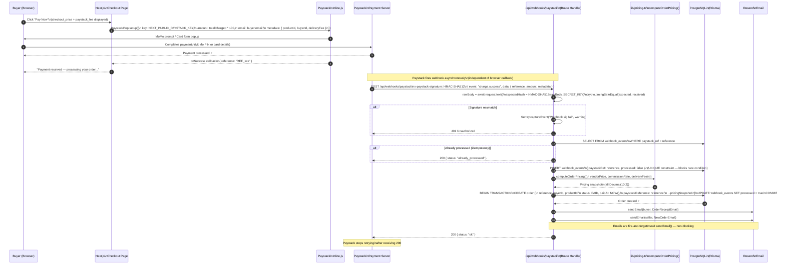

## <span style="color:#D1148A;">4.2 Managed Dispatch & OTP Delivery Flow</span>

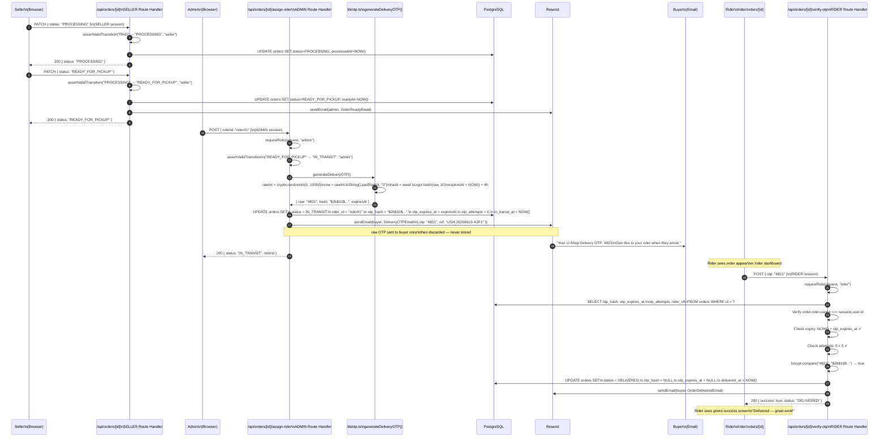

## <span style="color:#D1148A;">4.3 Order Lifecycle State Machine</span>

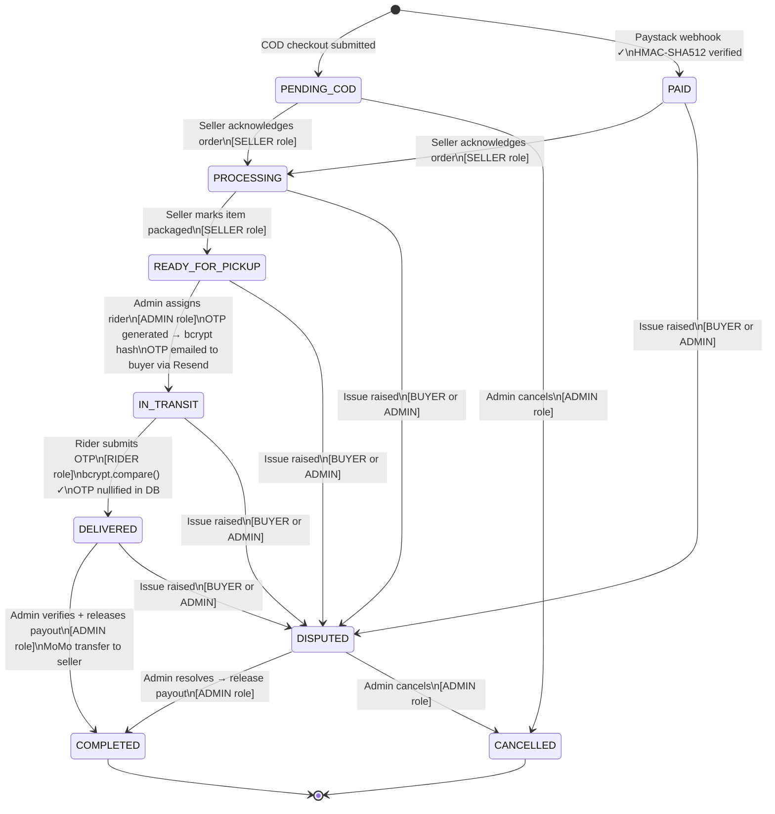

---

<br/>

<a name="s5"></a>

# <span style="color:#5D1A89;">5. Entity-Relationship Blueprint</span>

## <span style="color:#D1148A;">5.1 Core ER Diagram</span>

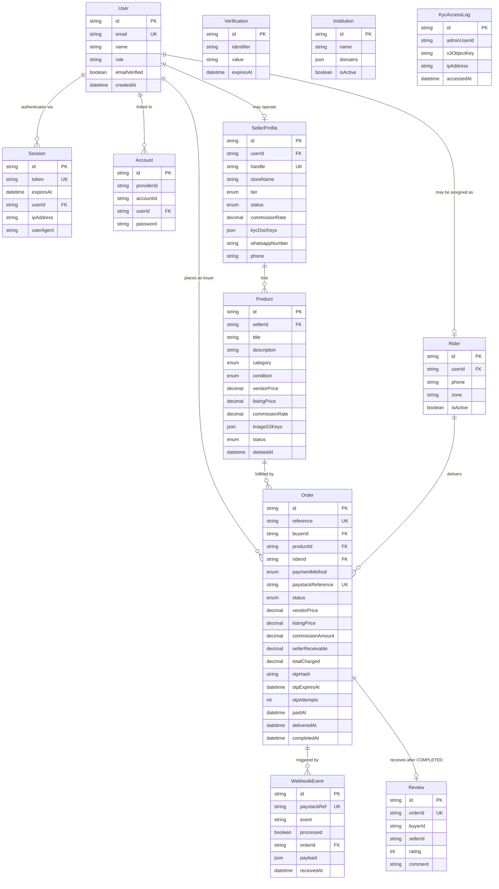

## <span style="color:#D1148A;">5.2 Zero Buyer-Seller Communication — Enforced in Schema</span>

The strict zero-contact policy is **structurally enforced** in the data model, not just in UI logic:

| Enforcement Point | Implementation |
|---|---|
| **No `Message` model** | There is no chat, messaging, or contact table in the schema. It cannot be added without a migration. |
| **Contact fields on `SellerProfile`** | `whatsappNumber` and `phone` exist in the DB for admin use but are **excluded by default in all Prisma queries** serving buyer-facing endpoints via explicit `select` blocks. |
| **Rider phone** | Stored on `Rider` model. Returned in order detail API **only when** `order.status === "IN_TRANSIT"` AND `order.buyerId === session.user.id`. |
| **No buyer→seller FK on reviews** | The `Review` model captures `buyerId` and `sellerId` as strings but does not create a bidirectional communication path — it is write-once at `COMPLETED` state. |
| **API contract** | `GET /api/storefront/{handle}` Prisma query uses `select: { whatsappNumber: false, phone: false }`. Verified in integration tests. |

## <span style="color:#D1148A;">5.3 Key Schema Design Decisions</span>

| Decision | Rationale |
|---|---|
| `Order.otpHash` stores bcrypt hash, not raw OTP | Raw OTP is generated, emailed to buyer, then discarded. Only the hash persists. Prevents DB breach from exposing delivery OTPs. |
| `Order` has all pricing fields (`vendorPrice`, `listingPrice`, `commissionAmount`, etc.) | Immutable snapshot at order creation. `SellerProfile.commissionRate` can change without affecting historical order records. |
| `WebhookEvent.paystackRef` has `@unique` constraint | Database-level idempotency key. The second concurrent write of the same reference throws `P2002` and is safely rejected. |
| `SellerProfile.kycDocKeys` is `Json` (string array) | Stores S3 keys for up to 3 documents (student ID, Ghana card front/back, business doc). Flexible without a separate `KycDocument` table. |
| `Product.imageS3Keys` is `Json` (string array) | Stores up to 5 S3 keys. Retrieved atomically with the product for S3 cleanup on deletion. |
| `Rider` is a separate model (not just a User role) | Separates rider operational data (phone, zone, isActive) from the Better Auth `User` model. Admin manages rider records independently. |
| `Institution` stored in DB, not code | The approved `.edu.gh` institution list can be updated by admin via the dashboard without a code deployment or Vercel redeployment. |

---

<br/>

<a name="s6"></a>

# <span style="color:#5D1A89;">6. DevOps & Observability Pipeline</span>

## <span style="color:#D1148A;">6.1 CI/CD Architecture</span>

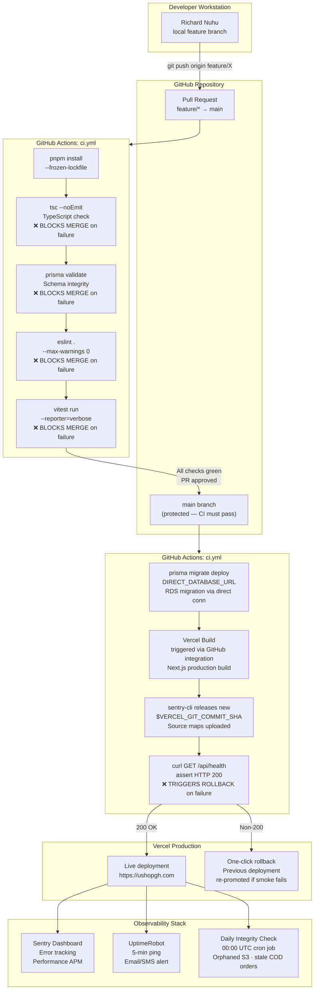

## <span style="color:#D1148A;">6.2 Sentry Instrumentation Architecture</span>

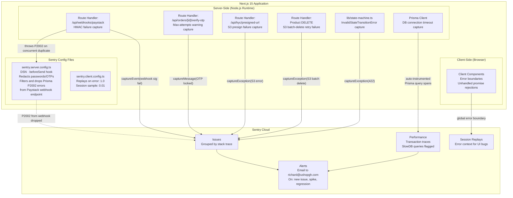

## <span style="color:#D1148A;">6.3 Mandatory Sentry Capture Points</span>

| Location | Event | Sentry Level | Captured Fields |
|---|---|---|---|
| `verify-otp` Route Handler | `otpAttempts >= OTP_MAX_ATTEMPTS` | `warning` | `orderId`, `riderId`, `attempts` |
| `deleteProductImages()` | S3 batch delete after 3 retries | `error` | `productId`, `imageS3Keys`, `s3Error` |
| `webhooks/paystack` | HMAC signature mismatch | `warning` | Truncated signature (first 16 chars) |
| `transitionOrderStatus()` | `InvalidStateTransitionError` thrown | `error` | `from`, `to`, `orderId`, `actorRole` |
| `generateKYCPresignedUrl()` | S3 client throws | `error` | `s3Key` (no content) |
| `lib/prisma.ts` | `$connect()` failure at cold start | `fatal` | Node.js error message |
| Server Components / Route Handlers | `auth.api.getSession()` throws unexpectedly | `warning` | `pathname`, `userId`, `error type` |
| `sendEmail()` in `lib/email/send.ts` | Resend API call fails | `error` | `to` (email), `subject` (no body) |

## <span style="color:#D1148A;">6.4 Database Migration Strategy</span>

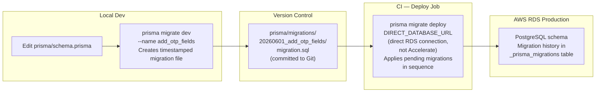

> **Why `DIRECT_DATABASE_URL` for migrations?** Prisma Accelerate is a query proxy — it cannot run DDL statements. `prisma migrate deploy` must connect directly to the RDS endpoint using the `directUrl` datasource field, bypassing Accelerate.

---

<br/>

<a name="s7"></a>

# <span style="color:#5D1A89;">7. Architecture Decision Records</span>

> ADRs document significant architectural decisions, their context, and the trade-offs accepted. Each ADR is immutable once accepted.

---

## <span style="color:#D1148A;">ADR-001: Unified Full-Stack Next.js vs. Separate Frontend/Backend</span>

| Field | Detail |
|---|---|
| **Date** | June 1, 2026 |
| **Status** | Accepted |
| **Decision** | Build U-Shop as a single Next.js 15 App Router monorepo deployed to Vercel. No separate Express/Fastify backend. |

**Context:** A solo developer needs to ship a production-quality marketplace in 3 months with zero DevOps overhead. The traditional split (React SPA + Node.js API) requires two deployment targets, two CI pipelines, CORS configuration, and two codebases to maintain.

**Consequences — Positive:**
- One repo, one deploy. `git push` to `main` deploys the entire platform.
- Server Components eliminate client-side data fetching boilerplate and reduce JS bundle size.
- Server Actions replace REST endpoints for form mutations — type-safe, co-located with UI.
- Route Handlers remain for external integrations (Paystack webhooks, Resend, S3 presigned URLs).

**Consequences — Negative:**
- Vercel Hobby tier 10-second function timeout constrains long-running operations. Mitigated by async background patterns (`waitUntil()` helper). `setImmediate` is prohibited as Vercel freezes execution contexts immediately after response.
- No native WebSocket support on Vercel Hobby. Real-time features (order status push) deferred to V2.

---

## <span style="color:#D1148A;">ADR-002: Better Auth (Session-Based) vs. Custom JWT</span>

| Field | Detail |
|---|---|
| **Date** | June 1, 2026 |
| **Status** | Accepted |
| **Decision** | Use `better-auth` with `@better-auth/prisma-adapter` for all authentication. Custom JWT implementation prohibited. |

**Context:** A custom JWT implementation requires: token generation, HMAC signing, refresh token rotation, secure cookie flag management, clock skew handling, and revocation logic. A solo developer building 37 features in 3 months cannot safely own all of this surface area.

**Consequences — Positive:**
- Sessions stored in PostgreSQL via Prisma adapter — instantly revocable server-side (vs. JWT which cannot be revoked before expiry).
- Password hashing (Argon2id) managed by the library — no developer-owned crypto.
- Role claim is a DB field (`user.role`) — role changes take effect on the next request, not after token expiry.
- `better-auth.session_token` cookie is HttpOnly + Secure by default.

**Consequences — Negative:**
- Every authenticated request requires a DB lookup (`SELECT sessions JOIN users`). Mitigated by Better Auth's 5-minute `cookieCache` reducing DB round-trips for short sessions.
- Adds 4 new DB tables managed by the library. Schema is less minimal.

---

## <span style="color:#D1148A;">ADR-003: Prisma Accelerate for Serverless Connection Pooling</span>

| Field | Detail |
|---|---|
| **Date** | June 1, 2026 |
| **Status** | Accepted |
| **Decision** | Route all Prisma queries through Prisma Accelerate. Direct RDS connections are used only for `prisma migrate deploy` in CI. |

**Context:** AWS RDS `db.t2.micro` supports approximately 87 concurrent PostgreSQL connections. Vercel serverless functions are stateless and short-lived — each invocation opens a new connection. Under modest load (100 concurrent page loads), the connection limit is breached without pooling.

**Alternatives Considered:**
- **PgBouncer on EC2 t2.micro:** Free but requires managing another server, firewall rules, health monitoring.
- **Supabase PostgreSQL (built-in PgBouncer):** Would require migrating from AWS RDS, losing the AWS free tier.
- **Prisma Accelerate:** Managed service, zero infrastructure, integrates via `DATABASE_URL` replacement. Free tier generous enough for V1 traffic.

**Consequences — Positive:** Zero connection exhaustion risk. No additional server to manage. Query caching available in V2.

**Consequences — Negative:** Adds a third-party dependency in the critical data path. Network hop from Vercel → Accelerate → RDS adds ~5–15ms latency vs. direct connection.

---

## <span style="color:#D1148A;">ADR-004: 7-State Order Lifecycle vs. Simpler 3-State Model</span>

| Field | Detail |
|---|---|
| **Date** | June 1, 2026 |
| **Status** | Accepted |
| **Decision** | Implement a 7-state typed state machine (`PAID → PROCESSING → READY_FOR_PICKUP → IN_TRANSIT → DELIVERED → COMPLETED → DISPUTED`) with `assertValidTransition()` enforcing illegal transitions. |

**Context:** The Managed Dispatch model requires granular tracking of physical order movement. A simple `PAID → DELIVERED → COMPLETED` model cannot represent: seller packaging time, rider assignment, OTP verification, or dispute windows. Each state has a distinct actor, trigger, and side effect.

**Consequences — Positive:**
- Illegal transitions (e.g. `PROCESSING → COMPLETED`) rejected at API layer with `HTTP 422`.
- Timestamp fields (`paidAt`, `processedAt`, `readyAt`, etc.) provide a full audit trail.
- Side effects (OTP generation, email triggers) are deterministically tied to specific transitions.

**Consequences — Negative:**
- More complex seller dashboard (6 distinct states visible to seller). Mitigated by clear status labels and contextual CTAs.

---

## <span style="color:#D1148A;">ADR-005: Zero Buyer-Seller Communication (Policy → Architecture Impact)</span>

| Field | Detail |
|---|---|
| **Date** | June 1, 2026 |
| **Status** | Accepted |
| **Decision** | No in-app messaging between buyers and sellers at any state. Seller contact fields excluded at Prisma `select` level in all buyer-facing queries. Rider phone number is the sole buyer-accessible contact channel (during `IN_TRANSIT` only). |

**Context:** PRD v1.3 mandates this as a platform policy to prevent off-platform transaction solicitation and simplify V1 development scope (removes ~2 weeks of messaging infrastructure). The architectural consequence is that no `Message` model, no chat polling, and no WebSocket is required in V1.

**Consequences — Positive:**
- Significant scope reduction (no real-time messaging infrastructure).
- Eliminates the surface area for data leaks of seller personal contact.
- Rider-mediated communication is architecturally simpler to reason about.

**Consequences — Negative:**
- Buyers cannot ask sellers product questions pre-purchase. Mitigated by complete product descriptions and detailed listing requirements.

---

## <span style="color:#D1148A;">ADR-006: Gross-Up Commission Model vs. Net Deduction</span>

| Field | Detail |
|---|---|
| **Date** | June 1, 2026 |
| **Status** | Accepted |
| **Decision** | Use gross-up pricing: `listingPrice = vendorPrice / (1 - commissionRate)`. The commission is embedded in the buyer-facing price. Seller always receives their exact `vendorPrice`. |

**Context:** In a net-deduction model, a seller listing at GHS 350 receives GHS 332.50 after 5% commission — creating post-sale confusion and seller trust issues. In the gross-up model, the seller receives exactly GHS 350; the buyer pays GHS 368.42. The platform's revenue is sourced from the buyer, not the seller.

**Consequences — Positive:**
- Seller experience is predictable and transparent (enter price, receive that exact price).
- Pricing logic is a pure function — easy to test, easy to audit.

**Consequences — Negative:**
- Buyer pays slightly more than the listed product price. Mitigated by a clear tooltip on the product page explaining the gross-up.
- Rounding on `Decimal(10,2)` must be consistently applied (ROUND_HALF_UP) to avoid commission drift over thousands of orders.

---

<br/>

<a name="s8"></a>

# <span style="color:#5D1A89;">8. Document History</span>

| Version | Date | Author | Changes |
|---|---|---|---|
| **1.1** | **June 9, 2026** | **Richard Nuhu** | **Patch release resolving 4 production bottlenecks: (1) §2.3, §2.1 — Edge Middleware request flow updated to lightweight cookie-presence check only; database-backed auth deferred to server-side Node.js functions. (2) §3.1, §3.4 — S3 deletion execution context updated to use Vercel waitUntil() instead of prohibited setImmediate pattern. (3) §6.2, §6.3 — Sentry beforeSend hook updated to filter and drop P2002 errors from Paystack webhook endpoints. (4) §3.3 — KYC document viewer flow updated to reflect the lazy-load UX mandate with zero upfront S3 presigned URL generation.** |
| **1.0** | **June 1, 2026** | **Richard Nuhu** | **Initial release. Covers: End-to-end infrastructure topology diagram (Cloudflare → Vercel → AWS → Third-Party). Prisma Accelerate connection pool topology. Better Auth integration architecture with session lifecycle sequence diagram. RBAC Middleware gate sequence diagram. Dual S3 bucket architecture with KYC upload, presigned URL, and image lifecycle flow diagrams. Checkout & Paystack HMAC webhook sequence diagram. Managed Dispatch & OTP delivery sequence diagram. 7-state order lifecycle stateDiagram. Core ER diagram (User, SellerProfile, Product, Order, Rider, WebhookEvent, Review). Zero buyer-seller communication schema enforcement documentation. CI/CD flowchart (GitHub Actions → Vercel). Sentry instrumentation architecture diagram with mandatory capture points. DB migration strategy diagram. 6 Architecture Decision Records (ADR-001 through ADR-006).** |

---

<br/>

<div align="center">

<p style="color:#94A3B8;font-style:italic;">— End of Document —</p>
<p style="color:#94A3B8;font-style:italic;font-size:0.85em;">U-Shop SAD v1.1 &nbsp;·&nbsp; Author: Richard Nuhu &nbsp;·&nbsp; ushopgh.com &nbsp;·&nbsp; Principal Architecture Reference &nbsp;·&nbsp; Confidential</p>
<br/>
<span style="background:#FF0000;color:#FFFFFF;padding:2px 10px;font-weight:900;border-radius:3px;">U</span>&nbsp;<span style="color:#5D1A89;font-weight:900;">sh</span><span style="color:#D1148A;font-weight:900;">op</span>

</div>
